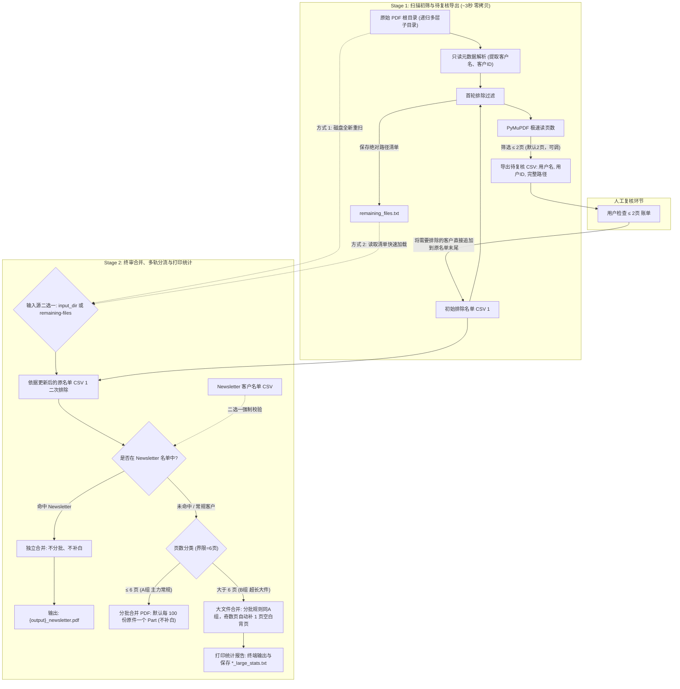

# 大规模 PDF Statement 批量处理工具 (pdftool.py) 使用指南与交付报告

## 1. 工具简介与核心优势

`pdftool.py` 是专为处理海量月度/季度账单 PDF（单次处理量 >3000 份，支持多层嵌套子目录）而设计的高性能、生产级批量处理工具。

### 核心优势
1. **全流程零拷贝 (Zero-Copy Manifest Architecture)**：
   - 原始文件夹及其子目录严格保持**只读**，绝不进行物理文件复制，节省数 GB 的磁盘空间与无效 I/O 写入；
   - 3000+ 个文件的初筛和扫描从传统的数分钟缩短至 **2~3 秒**。
2. **极速元数据解析**：
   - 采用 `pathlib` 递归遍历与 PyMuPDF 底层元数据探查（无需渲染页面即读页数，单文件耗时 <1ms）。
3. **独立解耦解析器 (`FilenameParser`)**：
   - 文件名解析逻辑封装于独立类与 `StatementInfo` 数据类中，未来若账单命名规则变动，仅需调整解析器，业务逻辑零侵入。
4. **双面打印保护（Odd-Page Padding）**：
   - 对超长账单（>6页）中的奇数页文档，末尾自动插入 1 页空白背页，使总页数变为偶数，避免双面打印装订时不同客户的账单串联。
5. **防御性安全机制**：
   - Stage 2 强制要求显式指定 Newsletter 处理规则（`--newsletter_csv` 或 `--no-newsletter`），彻底杜绝用户遗漏分流；
   - 遇到非标异常文件名时，自动高亮报警并导出 `unrecognized_files.csv`，跳过处理防误操作；
   - 输出目标目录不存在时自动递归创建。

---

## 2. 完整业务工作流



---

## 3. 快速上手操作指南

### 步骤 1：运行 Stage 1（初筛与生成待复核名单）
```bash
python pdftool.py stage1 \
  --input_dir "D:\Statements\All_July" \
  --exclude_csv "D:\Config\Deleted_Clients.csv"
```
- **默认行为**：
  - 自动递归扫描 `All_July` 及其所有下级子目录中的 `.pdf` 文件（忽略其他格式）；
  - 按照 `Deleted_Clients.csv` 排除首轮客户；
  - 在当前工作目录生成 `remaining_files.txt`（记录保留文件绝对路径）；
  - 自动筛选 `≤ 2页` 的小账单，并在当前目录生成待复核文件 `All_July_review_under_2pages.csv`。
- **自定义初筛页数（可选）**：
  ```bash
  python pdftool.py stage1 --input_dir "..." --exclude_csv "..." --review_pages 3
  ```

---

### 步骤 2：人工复核 (Review)
1. 用 Excel 打开生成的 `All_July_review_under_2pages.csv`；
2. 核对这批页数极少的账单，挑选出确认需要排除的客户；
3. 将这些客户的行（姓名、客户ID）**直接复制追加到原 `Deleted_Clients.csv` 文件的末尾并保存**。

---

### 步骤 3：运行 Stage 2（终审合并与打印统计）

#### 场景 A：包含 Newsletter 客户（最常用的标准直观模式）
```bash
python pdftool.py stage2 \
  --input_dir "D:\Statements\All_July" \
  --exclude_csv "D:\Config\Deleted_Clients.csv" \
  --newsletter_csv "D:\Config\Newsletter_clients.csv" \
  --output_prefix "D:\Output\July_Statements"
```

#### 场景 B：本次批次没有 Newsletter 客户
为防止用户疏忽遗漏 Newsletter，程序强制要求显式传入 `--no-newsletter` 声明：
```bash
python pdftool.py stage2 \
  --input_dir "D:\Statements\All_July" \
  --exclude_csv "D:\Config\Deleted_Clients.csv" \
  --no-newsletter \
  --output_prefix "D:\Output\July_Statements"
```

#### 场景 C：高级参数组合
- **自定义分批大小**（例如修改为每 200 份一个 Part）：
  ```bash
  python pdftool.py stage2 ... --batch_size 200
  ```
- **完全不分批**（将 A组 和 B组 各自整合成一个完整的单体 PDF）：
  ```bash
  python pdftool.py stage2 ... --no_batch
  ```
- **跳过磁盘扫描，直接基于清单运行**：
  ```bash
  python pdftool.py stage2 --remaining-files "remaining_files.txt" --exclude_csv "..." --newsletter_csv "..." --output_prefix "..."
  ```

---

## 4. 合并分组与输出命名规范

| 分组类别 | 判定条件 | 输出文件命名 | 分批策略 (默认 100 份/批) | 补白 (Padding) 规则 |
|---|---|---|---|---|
| **分组 N (Newsletter)** | 命中 `--newsletter_csv` 名单 | `{prefix}_newsletter.pdf` | **不分批**（合并为 1 个独立文件） | **不补白**（保持原样） |
| **分组 A (主力常规)** | 未命中 Newsletter 且 `页数 ≤ 6` | `{prefix}_part_1.pdf`<br>`{prefix}_part_2.pdf`... | **默认每 100 份原件一个 Part**<br>（若传 `--no_batch` 则为 `{prefix}.pdf`） | **不补白**（保持原样） |
| **分组 B (超长特殊)** | 未命中 Newsletter 且 `页数 > 6` | `{prefix}_large_part_1.pdf`<br>`{prefix}_large_part_2.pdf`... | **分批规则同 A 组完全一致**<br>（若传 `--no_batch` 则为 `{prefix}_large.pdf`） | **奇数页末尾自动插入 1 页空白页**<br>（使该份文件变为偶数页） |

> **业务优先级准则**：**排除绝对优先于 Newsletter**。若某客户既在 `exclude_csv` 又在 `newsletter_csv` 中，该客户将被彻底排除，绝不进入 Newsletter 组。

---

## 5. 大文件打印统计报表示例

处理完分组 B（>6页）后，终端控制台及输出目录下的 `*_large_stats.txt` 会自动生成打印统计：

```text
================================================================================
                    大文件 (>6页) 打印页数统计报表
================================================================================
最终打印页数        原文件页数分布构成                   文件数量(份)       占比(%)       总打印面数(P)
--------------------------------------------------------------------------------
 8            7页(2份), 8页(1份)              3             100.00%            24 P
--------------------------------------------------------------------------------
 合计                                       3             100.00%            24 P
================================================================================
* 说明: 所有奇数页原件已自动补充 1 页空白背页，确保双面打印装订不串页。
```

---

## 6. 命令行完整参数字典

### `stage1` 子命令参数
| 参数名 | 必填 | 默认值 | 说明 |
|---|:---:|:---:|---|
| `--input_dir` | 是 | - | 原始 PDF 根目录（自动递归检索所有子目录） |
| `--exclude_csv` | 是 | - | 初始排除客户名单 CSV（支持 UTF-8 / UTF-8-sig） |
| `--review_pages` | 否 | `2` | 待复核账单的页数上限 |
| `--review_csv` | 否 | 自动以目录命名 | 待复核 CSV 的输出完整路径 |
| `--remaining_files_out` | 否 | `./remaining_files.txt` | 保存保留文件绝对路径的文件路径 |

### `stage2` 子命令参数
| 参数名 | 必填 | 默认值 | 说明 |
|---|:---:|:---:|---|
| `--input_dir` | 二选一 | - | **模式 A**：全新递归扫描磁盘目录（无脏缓存） |
| `--remaining-files` | 二选一 | - | **模式 B**：直接读取 stage1 留下的文本清单 |
| `--exclude_csv` | 是 | - | 人工更新后的排除客户名单 CSV |
| `--newsletter_csv` | 互斥必选 | - | Newsletter 客户清单 CSV（优先独立合并） |
| `--no-newsletter` | 互斥必选 | - | 显式声明本次批次无需处理 Newsletter 客户 |
| `--output_prefix` | 否 | `./combined` | 输出文件路径及命名前缀（父目录自动递归创建） |
| `--normal_pages` | 否 | `6` | 主力常规账单与超长账单的页数分界阈值 |
| `--batch_size` | 否 | `100` | 每批次合并包含的原始 PDF 份数 |
| `--no_batch` | 否 | `False` | 开启后完全不分批，整组整合成单个单体 PDF |

---

## 7. 演练与验证记录 (Verification Log)

已使用 `do_not_touch/Aug2026_Thirteen_Samples_Layout_R3` 样本数据集进行了完整的端到端仿真测试：

1. **Stage 1 初筛测试**：排除 1 人后成功检出 2 份 `≤ 3页` 的账单导出至 CSV，清单生成 12 条记录；
2. **人工复核追加测试**：向排除名单追加 1 人后运行 Stage 2；
3. **Newsletter 强校验拦截测试**：在未指定 newsletter 规则时，程序 100% 拦截并报错提示；
4. **模式 A 磁盘重扫测试**：成功分流 1 份 Newsletter（6页）、7 份常规 A 组（分 3 个 Part）、3 份超长 B 组；
5. **双面打印补白验证**：经底层文本扫描验证，7 页原件后成功插入纯空白页（文本长度为 0），8 页原件保持不变，合并后总页数精准对齐 24 页；
6. **模式 B 清单读取与 `--no_batch` 测试**：成功读取清单并一次性合并为单体文件。
