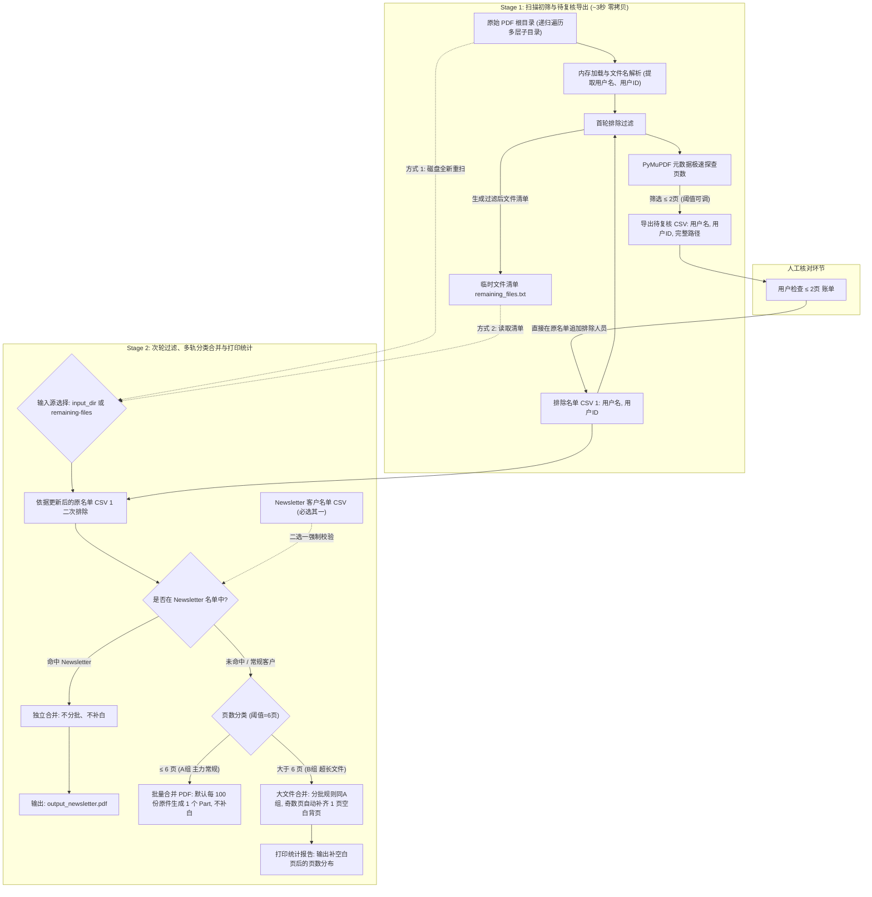

# 大规模 PDF Statement 批量处理工具设计与实施计划 (v2.0 零拷贝极速版)

## 1. 项目背景与核心原则

### 1.1 项目背景
针对大量月度/账单 PDF 文件（通常数量超过 3000 份，且分布在复杂的子目录树结构中），需要实现一套高效、安全、带有人工复核工作流的批量处理工具。

### 1.2 核心设计原则：**全流程零拷贝 (Zero-Copy Manifest Architecture)**
- **原始数据完全只读**：严禁修改、移动或物理复制原始 PDF 文件夹及其任何子文件。
- **虚拟清单代替物理落盘**：使用轻量级的**文件路径清单 (Manifest / File List)** 进行中间状态跟踪，避免产生数千个重复文件，避免产生数 GB 的无效磁盘 I/O 写入。
- **秒级极速处理**：Stage 1 阶段仅需读取文件元数据（页数）和路径，3000+ 个文件的初筛和扫描从原本复制所需的数分钟**缩短至 2~3 秒**。

---

## 2. 整体业务工作流架构



---

## 3. 核心功能模块详细设计

### 3.1 模块 1：递归扫描与智能提取 (`recursive_scanner`)
- **全面采用 `pathlib` 递归遍历**：
  采用现代面向对象的 `pathlib.Path` 进行遍历，直接筛选有效文件，**只关注 `.pdf` 文件（不区分大小写），其他非 PDF 文件（如 `.csv`, `.txt`, `.md`, `.zip` 等）直接忽略跳过**：
  ```python
  from pathlib import Path

  input_path = Path(input_dir)
  pdf_files = [
      p.resolve() for p in input_path.rglob("*")
      if p.is_file() and p.suffix.lower() == ".pdf"
  ]
  ```
- **智能文件名提取抽象层（独立 Class / 解耦设计）**：
  为应对未来文件名格式可能发生的变化，将文件名解析逻辑**完全独立抽象为专用的解析器类 `FilenameParser`** 与结构化数据载体 `StatementInfo`。未来若格式变动，**只需修改此类中的单一解析方法，无需触动任何上下游业务逻辑**：
  ```python
  from dataclasses import dataclass
  from pathlib import Path
  import re

  @dataclass
  class StatementInfo:
      path: Path             # 文件完整绝对路径
      raw_filename: str      # 原始文件名
      user_name: str         # 解析出的用户名
      user_id: str           # 解析出的用户ID
      extra_info: str = ""   # 其他描述信息 (如月份、账单类型)

  class FilenameParser:
      """
      独立的文件名提取器。未来若文件名格式变动，仅需调整此类的 parse 方法即可。
      """
      # 示例规则：CHEN_Mei_Ling_415137934_Aug2026_Interim_Breakdown.pdf
      PATTERN = re.compile(
          r"^(?P<name>[A-Za-z0-9_\s-]+?)_(?P<id>\d{6,12})(?:_(?P<extra>.*))?\.pdf$",
          re.IGNORECASE
      )

      @classmethod
      def parse(cls, file_path: Path) -> StatementInfo:
          filename = file_path.name
          match = cls.PATTERN.match(filename)
          if match:
              raw_name = match.group("name")
              # 下划线转空格，规范化姓名
              user_name = " ".join(raw_name.replace("_", " ").split())
              user_id = match.group("id")
              extra_info = match.group("extra") or ""
              return StatementInfo(
                  path=file_path,
                  raw_filename=filename,
                  user_name=user_name,
                  user_id=user_id,
                  extra_info=extra_info
              )

          # 备用回退解析规则 (Fallback)：应对部分非标文件名
          return cls._fallback_parse(file_path)

      @classmethod
      def _fallback_parse(cls, file_path: Path) -> StatementInfo:
          ...

  - **未识别文件处理策略（防御性机制）**：
    若主规则与回退规则均无法解析出有效 `user_id`，系统会将该文件记录在**异常警告列表 (`unrecognized_files`)** 中：
    1. 在终端输出显著警告，提示文件名格式异常；
    2. 自动导出 `unrecognized_files.csv`（记录文件路径与文件名）供人工排查；
    3. 跳过该文件不参与排除与后续合并，彻底防止因文件名异常导致的误合并或误排。

### 3.2 模块 2：首轮清单过滤与临时清单保存 (`manifest_manager`)
- **精确排除比对机制**：
  - 读取用户提供的排除 CSV（两列：`用户名`, `用户ID`，兼容 Windows Excel `utf-8-sig` 编码与有无表头）；
  - 将所有排除项的 `User ID` 存入内存 `set` 集合；
  - **核心匹配**：直接通过 `info.user_id in exclude_id_set` 进行精准 O(1) 集合比对；若回退文件无精确 ID，则辅以文件名子串比对 `_{User ID}_`。
- **生成临时路径清单**：
  - 将所有初筛保留下来的 PDF **完整绝对路径**写入清单文件；
  - **默认保存路径**：明确固定保存在**当前工作目录**下的 `remaining_files.txt`（`Path.cwd() / "remaining_files.txt"`），亦支持通过 `--remaining_files_out` 自定义路径；
  - 此清单供 Stage 2 模式 B 可选加载，跳过重复扫描磁盘。

### 3.3 模块 3：页数极速扫描与待复核 CSV 导出 (`review_exporter`)
- **极速读取**：调用 `doc = fitz.open(fullpath)` 读取 `doc.page_count` 后立即关闭，只读 header/xref，单文件不到 1ms。
- **小页数过滤**：筛选 `page_count <= 2`（参数 `--review_pages` 可配，默认 2 页）。
- **待复核 CSV 规范**：
  - 默认文件名：根据输入文件夹名称自动命名（例如输入目录为 `July_statements`，默认生成 `July_statements_under_2pages.csv`），也可通过命令行显式指定。
  - 编码格式：`utf-8-sig`。
  - 列结构：
    | 列 1 | 列 2 | 列 3 |
    |---|---|---|
    | **用户名** (User Name) | **用户ID** (User ID) | **文件fullpath** (Full Path) |
    | `ZHAO Yuhua` | `414496878` | `D:\statements\sub\ZHAO_Yuhua_414496878_...pdf` |

### 3.4 模块 4：第二阶段多轨合并引擎 (`combine_engine`)
人工在复核 CSV 中标记需要追加排除的客户，更新首个 CSV 1 文件后，启动 Stage 2：
1. **二次排除过滤（排除绝对优先，底层逻辑复用）**：
   - 载入更新后的原排除 CSV 1；
   - **底层复用**：Stage 2 模式 A 内部完全复用 Stage 1 的底层扫描与排除判定逻辑，确保两阶段行为 100% 幂等一致；
   - **优先级准则（排除 > Newsletter）**：若某个客户**既在排除名单中，又在 Newsletter 名单中**，该客户将直接被彻底排除，绝不进入 Newsletter 组。
2. **分组 N：Newsletter 客户独立合并（优先分流）**：
   - **严格防呆校验（必须二选一显式指定）**：
     - 用户在运行 Stage 2 时，**必须显式提供 `--newsletter_csv <path>` 或 `--no-newsletter` 之一**；
     - **若两者均未指定，程序立即报错中断**，并在终端输出友好提示，防止用户因疏忽而遗漏 Newsletter 客户的分流处理：
       ```text
       [!] 错误: Stage 2 要求显式指定 Newsletter 规则！
           - 若有 Newsletter 客户，请加上参数: --newsletter_csv <path_to_csv>
           - 若本次无需处理 Newsletter，请加上显式参数: --no-newsletter
       ```
   - 若提供 `--newsletter_csv`：从**已排除过**的纯净客户中，提取匹配 Newsletter 名单的 PDF；
     - **排序规则**：合并前按文件名字母升序排序（`sorted(key=lambda x: x.path.name.lower())`），确保批次顺序稳定；
     - **处理规则**：**不补白**、**不分批**，全部合并为一个单独的完整 PDF 文件；
     - 输出命名：`{output_name}_newsletter.pdf`；
     - 命中此名单的客户文件直接归入本组，不再进入后续的分组 A 和分组 B；
   - 若传入 `--no-newsletter`：跳过本组分流，所有文件直接进入分组 A 和分组 B。
3. **分组 A 与分组 B 统一的分批与排序策略 (Shared Strategy)**：
   - **全局稳定排序**：所有 PDF 在进入合并前，统一按照文件名字母升序排序（`key=lambda x: x.path.name.lower()`），保证合并结果与打印顺序绝对可复现；
   - **完全统一的分批参数**：分组 A 和分组 B **严格共用相同的分批设置，分批行为完全对称一致**：
     - **默认分批（未传参）**：分组 A 每 100 份合并为一个 Part；分组 B 同样每 100 份合并为一个 Part；
     - **自定义分批（`--batch_size N`）**：若传入 `--batch_size 200`，则 A 和 B 均按照每 200 份为一个 Part；
     - **不分批（`--no_batch` 或 `--batch_size -1`）**：A 组全部合并为一个文件，B 组也全部合并为一个文件。
4. **分组 A：主力常规文件合并 (`<= 6` 页，阈值可配)**：
   - 剩余未命中 Newsletter 的常规账单，且页数 `<= 6` 页进入本组，作为**主输出流**；
   - **不进行 Padding（不需要补空白页）**：原件是几页就合并几页；
   - 输出文件名格式：
     - 分批输出：`{output_name}_part_1.pdf`、`{output_name}_part_2.pdf` 等；
     - 不分批输出：`{output_name}.pdf`；
   - **原生极速合并**：使用 PyMuPDF 原生 `insert_pdf`，画质 100% 无损。
5. **分组 B：大页数文件合并与双面打印补白 (`> 6` 页)**：
   - 剩余未命中 Newsletter 的账单，且页数 `> 6` 页进入本组；
   - **分批行为与 A 组一致**，输出文件名格式：
     - 分批输出：`{output_name}_large_part_1.pdf`、`{output_name}_large_part_2.pdf` 等；
     - 不分批输出：`{output_name}_large.pdf`；
   - **双面打印保护（Padding，仅针对分组 B）**：若某一份原始文件是**奇数页**（例如 7 页、9 页），**自动在其后插入 1 页空白页**（尺寸沿用该文件末页尺寸），使其变为偶数页（8 页、10 页），避免双面打印串页；若原件已是偶数页（如 8 页）则不插入空白页。
6. **输出目录自动创建与内存管理机制**：
   - **目录自动创建**：当 `--output_prefix` 指定的目标目录（父目录）不存在时，系统自动执行 `output_path.parent.mkdir(parents=True, exist_ok=True)` 递归创建目录，无需用户手动新建；
   - **流式垃圾回收**：使用流式追加并定时 `gc.collect()`，合并过程中单进程内存稳定在 200MB 以内，轻松应对数千个文件合并。

### 3.5 模块 5：大文件打印统计报表 (`stats_reporter`)
针对分组 B（> 6 页）的文件，在终端控制台和文本日志中输出清晰的统计数据（按**补充完空白页后的最终打印页数**计算）：

```text
================================================================================
                    大文件 (>6页) 打印页数统计报表
================================================================================
 最终打印页数    原文件页数分布构成        文件数量(份)    占比(%)     总打印面数(P)
--------------------------------------------------------------------------------
 8 页           7页(15份), 8页(10份)           25         50.00%         200 P
 10 页          9页(12份), 10页(6份)           18         36.00%         180 P
 12 页          11页(4份), 12页(3份)            7         14.00%          84 P
--------------------------------------------------------------------------------
 合计                                          50        100.00%         464 P
================================================================================
* 说明：所有奇数页原件已自动补充 1 页空白背页，确保双面打印装订不串页。
```

---

## 4. 命令行接口 (CLI) 设计（采用方案 A 子命令模式）

系统采用职责清晰、高度自动化的**子命令模式**（`stage1` 与 `stage2`）。

### 4.1 Stage 1 命令：扫描目录、初筛排除、生成清单与待复核 CSV
- **`--review_pages` 默认值为 `2`，日常使用时无需显式输入**；
- 待复核 CSV 默认自动根据输入目录名命名（例如输入目录为 `All_July`，自动生成 `All_July_review_under_2pages.csv`），无需强制传参。

```bash
# 【最简常用命令】（无需输入 --review_pages，自动按 <= 2 页筛选并自动命名 CSV）
python pdftool.py stage1 \
  --input_dir "D:\statements\All_July" \
  --exclude_csv "D:\config\Deleted_Clients.csv"

# 【自定义场景】若需修改初筛页数为 3 页，或手动指定复核 CSV 路径：
# python pdftool.py stage1 \
#   --input_dir "D:\statements\All_July" \
#   --exclude_csv "D:\config\Deleted_Clients.csv" \
#   --review_pages 3 \
#   --review_csv "D:\config\My_Custom_Review.csv"
```

---

### 4.2 人工复核环节 (Review)
用户打开生成的待复核 CSV，核对账单后，将确认需要排除的人员直接追加至 `D:\config\Deleted_Clients.csv` 并保存。

---

### 4.3 Stage 2 命令：二次排除、Newsletter优先分流、常规与大文件对称分批合并

- **双输入源机制（指定谁就按谁执行，无隐式黑盒）**：
  - **模式 A（传 `--input_dir`）**：**完全从头扫描磁盘目录**并按最新排除 CSV 过滤，绝不依赖旧清单，保证 100% 确定性和最新鲜的数据；
  - **模式 B（传 `--remaining-files`）**：**直接读取清单文件中的路径列表**，仅针对新追加的人员做二次排除，适合跳过磁盘目录扫描；
  - *(注：Stage 2 必须提供 `--input_dir` 或 `--remaining-files` 之一)*
- **分批参数对称一致**：A组（常规）与 B组（大文件）**共享相同分批规则，默认均为 100 份/批**；
- **防呆拦截要求**：必须显式二选一传入 `--newsletter_csv` 或 `--no-newsletter`。

```bash
# 【方式 1：基于 input_dir 磁盘全新重扫与二次排除】（最安全可靠，无脏缓存隐患）
python pdftool.py stage2 \
  --input_dir "D:\statements\All_July" \
  --exclude_csv "D:\config\Deleted_Clients.csv" \
  --newsletter_csv "D:\config\Newsletter_clients.csv" \
  --output_prefix "D:\output\July_Combined"

# 【方式 2：基于 remaining_files.txt 清单继续二次排除】
# python pdftool.py stage2 \
#   --remaining-files "remaining_files.txt" \
#   --exclude_csv "D:\config\Deleted_Clients.csv" \
#   --newsletter_csv "D:\config\Newsletter_clients.csv" \
#   --output_prefix "D:\output\July_Combined"

# 场景 2：本次无 Newsletter 客户（显式声明 --no-newsletter 防止误操作）
# python pdftool.py stage2 \
#   --input_dir "D:\statements\All_July" \
#   --exclude_csv "D:\config\Deleted_Clients.csv" \
#   --no-newsletter \
#   --output_prefix "D:\output\July_Combined"

# 场景 3：自定义分批大小（A组与B组均按照 200 份分批）
# python pdftool.py stage2 ... --batch_size 200

# 场景 4：完全不分批（A组和B组各自整合成一个单文件）
# python pdftool.py stage2 ... --no_batch
```
*(注：`--normal_pages` 默认值为 6；批次 `--batch_size` 默认值为 100；输出目录不存在时自动创建)*

---

## 5. 实施与验证步骤

- [x] **Step 1: 编写核心库 `pdftool.py`**
  - 基于 `pathlib` 的递归遍历，只识别 `.pdf`，忽略其他所有类型；
  - 独立抽象 `FilenameParser` 类与 `StatementInfo` 数据结构；
  - 增加未识别文件防御机制（记录警告并在终端高亮提示，导出 `unrecognized_files.csv` 并跳过）；
  - 排除名单读取器（处理 BOM、表头容错、空行容错，构建 `user_id` 集合）；
  - Stage 1：生成 `remaining_files.txt` 清单（默认保存在当前工作目录）与导出 `<=` 2页 review CSV。
- [x] **Step 2: 编写 Stage 2 合并与统计模块**
  - 支持双输入源模式（`--input_dir` 磁盘全新重扫 与 `--remaining-files` 清单快速读取，模式 A 复用底层扫描逻辑）；
  - 参数防呆校验（强制要求显式传入 `--newsletter_csv` 或 `--no-newsletter`，否则中断报错提醒）；
  - 二次过滤逻辑（排除新追加客户，**排除绝对优先于 Newsletter**）；
  - 全局稳定排序机制（所有分组合并前统一按文件名字母升序排序）；
  - 分流处理 1：Newsletter 客户独立合并（单独生成 `{out}_newsletter.pdf`，不补白、不分批）；
  - 分流处理 2：`<=6页`（A组常规：不补白，默认 100 份/批，支持自定义调参或 `--no_batch`）；
  - 分流处理 3：`>6页`（B组超长：分批参数同A组，仅对奇数页自动补 1 页空白页）；
  - 移除 `--shrink` 与 `--space_top`，使用原生极速高质量合并；
  - 输出目录自动创建机制（父目录不存在时自动递归创建）；
  - 统计报表格式化打印模块。
- [x] **Step 3: 使用现有样本 (`do_not_touch`) 进行功能演练与验证**
  - 使用 `Deleted_Clients_name_list.csv` 和 `Aug2026_Thirteen_Samples_Layout_R3` 进行模拟测试；
  - 验证中文编码兼容性、补白正确性、报表输出格式。
- [x] **Step 4: 编写说明文档并交付**
